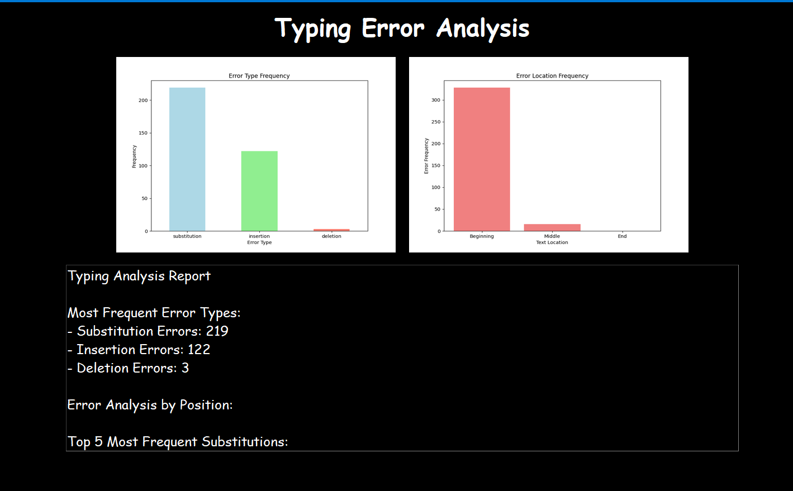

# Speed Typing Trainer - README

## Overview
This project is a Typing Speed Trainer application built using Python and Tkinter for graphical user interface (GUI) development. The application is designed to help users improve their typing speed and accuracy by presenting random sentences based on difficulty levels and a set time limit. The application tracks the user's typing performance and provides a summary of typing metrics once the time is up. It also allows users to analyze their progress after 21 days using an external analysis script.

## Home interface 

## Single run results

## 21 Day analysis



### Key Features:
- **Difficulty Levels:** Users can choose between three difficulty levels (Easy, Medium, Hard) based on the classification of sentences.
- **Time Limits:** Users can select a time limit of either 10 seconds, 30 seconds, or 2 minutes for typing a given sentence.
- **Typing Metrics:** After the time runs out, the application shows typing metrics like total letters, correct letters, and correct letters per second.
- **CSV Data Storage:** User inputs are stored in a CSV file for further analysis. This data can be combined with other datasets for deeper insights.
- **21-Day Analysis:** After 21 days of usage, users can run an external Python script to analyze their typing performance.
- **Instructions and Reset Functionality:** Users can view instructions on how to use the app, and they can reset the app to restart the typing session.

## Installation
To run this application, you need to have Python installed on your system. You will also need the following libraries:
- **Tkinter**: For creating the graphical user interface.
- **Pandas**: For handling CSV files and managing data.

You can install the required dependencies using `pip`:

```bash
pip install pandas
```

Since Tkinter comes pre-installed with Python, no additional installation is necessary.

## Usage
### Running the Application
To run the Typing Speed Trainer, simply run the following command in your terminal or command prompt:

```bash
python final.py
```

This will launch the main application window.

### Steps to Use:
1. **Select Difficulty Level:** Click on one of the difficulty buttons ("Easy", "Medium", or "Hard") to choose the classification of sentences.
2. **Choose Time Duration:** Select the time limit (10s, 30s, or 2m) for your typing session.
3. **Start Typing:** Once the difficulty and time are selected, a random sentence will appear. Type the sentence as quickly and accurately as possible.
4. **Submit Sentence:** Press the **Enter** key after typing the sentence to move on to the next sentence.
5. **View Results:** When the time is up, a popup will display your typing metrics (total letters typed, correct letters, and correct letters per second).
6. **Run 21-Day Analysis:** After typing for 21 days, you can analyze your performance by clicking on the "Run 21 Day Analysis" button, which runs an external Python script to analyze your typing data.

### File Handling:
- The application saves user input into a CSV file named `typing_data.csv`.
- The data can later be appended to another CSV file (`21_day.csv`) for longer-term analysis.
- The `typing_data.csv` file is cleared after the data is transferred to `21_day.csv`.

### Reset Application:
- To reset the application and start a fresh session, click on the **Reset** button. This will clear the current sentence, reset the timer, and allow the user to choose a new difficulty and time limit.

### Instructions:
Click on the **Instructions** tab to view a step-by-step guide on how to use the application.

### External Python Script:
- The "Run 21 Day Analysis" button will run an external script (`try.py`). This script analyzes the data from the typing sessions and provides an overview of the user's progress over 21 days.

## CSV Data Structure
The data is stored in CSV files for analysis:
1. **typing_data.csv**:
    - **Given Sentence**: The sentence displayed for the user to type.
    - **User Input**: The sentence typed by the user.

2. **21_day.csv**: A CSV file used to store aggregated typing data for further analysis.

## Example Usage Flow
1. Open the application and select **Easy** difficulty and **30 seconds**.
2. Type the sentence presented to you as fast as possible.
3. After the timer runs out, a popup will show how many letters you typed correctly and your typing speed in letters per second.
4. Repeat the typing session and analyze your performance by running the **21 Day Analysis** after accumulating enough data.

## File Paths
- **typing_data.csv**: Stores the typing data for each session.
- **21_day.csv**: Used for appending data after each session for long-term analysis.
- **try.py**: An external Python script for analyzing typing performance after 21 days.

## Troubleshooting
- If the CSV files are not present or empty, the application will automatically create `typing_data.csv` with appropriate headers.
- Ensure you have the necessary permissions to read/write to the CSV files in your project directory.

## License
This project is open-source. You can modify and distribute it under the terms of the [MIT License](https://opensource.org/licenses/MIT).

## Acknowledgments
- **Tkinter**: For creating the graphical user interface.
- **Pandas**: For handling CSV data and making data analysis simple.
- **Python**: For making this application possible.

---

Feel free to customize the README further based on any additional features or specific instructions you'd like to include for users.
